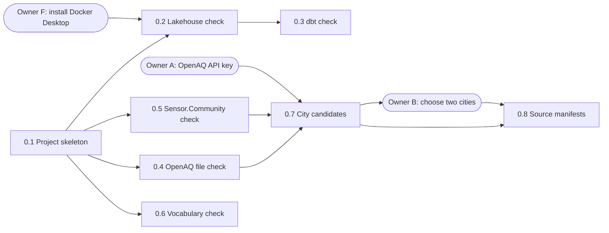
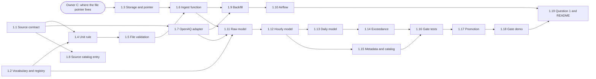
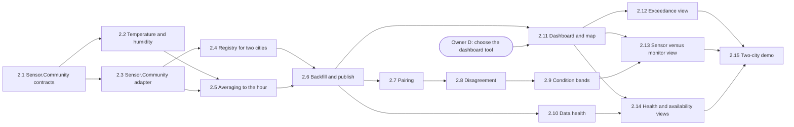
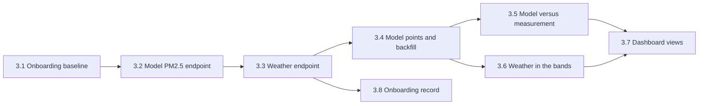
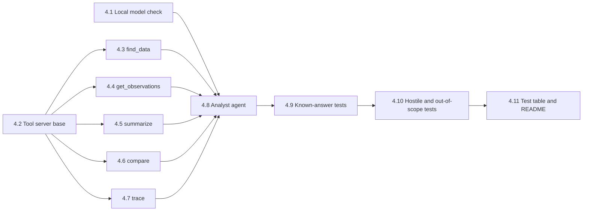
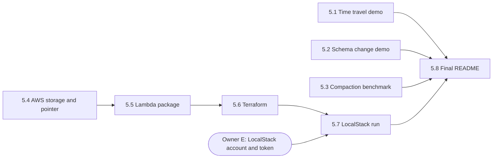

# Roadmap

Every milestone and every task of the project, in build order. `plan.md` says what the project is; this file says what gets built next.

## How to read it

- A **milestone** is a stage that ends with something that runs and can be shown.
- A **task** is one small pull request. `[x]` means it is merged. A task is ticked in its own pull request, so this file on `main` always shows what is done.
- **Needs** lists what must be merged before a task can start. Tasks that do not need each other can be built side by side.
- **Owner** items are things only the owner can do. A task that needs one waits for it.
- The diagram in each milestone shows the same "needs" as arrows. Rounded boxes are owner items.
- Milestones are built in order: a milestone starts when the one before it is finished.
- The project board on GitHub shows the same items as cards. A label on each card says whether it is ready, in progress, or waiting for the owner's review. This file is the source of truth; the board follows it.

Tasks in later milestones are a first cut. The checks in milestone 0 can change them. When a task is split, added or changed, this file and its diagram change in the same pull request.

---

## Milestone 0: Checks and skeleton

Prove the tools and the data behave as the plan assumes, before any pipeline code is written.

**At the end you can show:** a project that installs and tests with one command, and a record of every check with its result.

**Order of work:** 0.1, then 0.2, 0.4, 0.5 and 0.6 side by side, then 0.3 and 0.7, then 0.8.

- [ ] **Owner A: Get an OpenAQ API key.**
  Register at explore.openaq.org. The key stays on your machine and is never committed.

- [ ] **Owner B: Choose two cities.**
  Needs: 0.7. Pick from the table that task 0.7 produces.

- [ ] **Owner F: Install Docker Desktop.**
  Download it from docker.com and start it once. Task 0.2 uses it to run MinIO and the Iceberg catalog. This machine has no way to run containers yet.

- [x] **0.1 Project skeleton.** Package layout, linter, one test, hooks that run the linter before each commit and the tests before each push, and CI that runs both and reports the pull request size. Kept tiny on purpose: it is the trial run of the review loop.
  Needs: nothing. Done when: the tests pass locally with one command, a commit with a lint error is refused, and CI is green on the pull request.

- [ ] **0.2 Lakehouse check.** MinIO and an Iceberg catalog start with one command. DuckDB creates an Iceberg table, inserts rows, and reads an earlier snapshot.
  Needs: 0.1, Owner F. Done when: one command prints pass, or the fallback (write with PyIceberg, read with DuckDB) is shown working.

- [ ] **0.3 dbt check.** dbt builds one model into that Iceberg catalog. The dbt and DuckDB versions are pinned as tested.
  Needs: 0.2. Done when: one command builds the model, or the fallback is recorded with the reason.

- [ ] **0.4 OpenAQ file check.** Download one real day file without credentials and compare it with what the plan expects: header, exact unit text, hour convention, and how many days late files arrive.
  Needs: 0.1. Done when: a script prints each finding next to the expected value.

- [ ] **0.5 Sensor.Community check.** The licence read from a primary source. The columns of a dust file and of a temperature and humidity file, how the two join, how far apart readings are, and how many days late files arrive. The proposed valid ranges compared with real values.
  Needs: 0.1. Done when: the findings are recorded with their sources. If the licence is missing or unclear, the decision comes to the owner.

- [x] **0.6 Vocabulary check.** The standard names, the unit spellings and the WHO 15 µg/m³ value confirmed at their sources.
  Needs: 0.1. Done when: a short record with links is committed, and the vocabulary table in `plan.md` is corrected if anything differs.

- [ ] **0.7 City candidates.** A script lists cities where a reference monitor has low-cost sensors within about 1 km, with data from both since January 2025. It also reports whether each monitor measures temperature or humidity.
  Needs: 0.4, 0.5, Owner A. Done when: the script prints a table of candidates for the owner to choose from.

- [ ] **0.8 Source manifests.** For the chosen stations: ids, sensors and their parameters, unit text as found, timezone, licence and its permissions, gaps, and file hashes.
  Needs: 0.7, Owner B. Done when: the manifest files are committed and a test validates them.

---

## Milestone 1: One source, one city, PM2.5 end to end

OpenAQ data for one city goes from download to a published table, and answers question 1: on how many days did PM2.5 exceed the WHO value, and how does that compare with a year earlier.

**At the end you can show:** one command that runs the pipeline, the answer to question 1, and the gate blocking a bad file while the published tables stay unchanged.

**Order of work:** 1.1, 1.2 and 1.3 side by side. Then 1.4, 1.7 and 1.8. Then 1.5, then 1.6. Then 1.9 and 1.11. Then 1.10 and 1.12. Then 1.13 and 1.15. Then 1.14, 1.16, 1.17, 1.18 and 1.19 one after another.

- [ ] **Owner C: Decide where the pipeline records which file version is current.**
  SQLite, or DynamoDB Local. Both options are described under "Still to decide" in `plan.md`.

- [ ] **1.1 Source contract.** The YAML format that describes a source (fields, units, time convention, licence, duplicate key, which field is which parameter), its loader, and the OpenAQ contract.
  Needs: 0.4, 0.8. Done when: tests load the OpenAQ contract and reject a broken one.

- [ ] **1.2 Vocabulary and registry.** The dbt project with two seeds: the parameter vocabulary, holding PM2.5 only, and the registry of stations and sensors built from the manifests.
  Needs: 0.3, 0.6, 0.8. Done when: dbt loads both seeds and their tests pass.

- [ ] **1.3 Storage and pointer.** Two small interfaces with local versions: files in a directory, and the pointer that records which version of a file is current and only ever moves forward.
  Needs: Owner C. Done when: tests show a duplicate write is harmless and an older event cannot move the pointer back.

- [ ] **1.4 Unit rule.** Unit text is cleaned and must match the parameter's unit or a spelling its source lists.
  Needs: 1.1, 1.2. Done when: tests accept `µg/m³`, `μg/m3` and `ug/m3` for PM2.5 and reject any other unit.

- [ ] **1.5 File validation.** Structural checks only: the file opens, the header matches the contract, it has rows, its keys and dates match its name, and its units pass.
  Needs: 1.4. Done when: tests accept a good file and a short day, and reject each kind of broken file with a reason.

- [ ] **1.6 Ingest function.** Read a delivered file, validate it, store it as validated or quarantined under its content hash, then move the pointer.
  Needs: 1.3, 1.5. Done when: the unit tests listed under "Publish gate" in `plan.md` pass: duplicate event, broken newer version, stale replay, and a failure between the write and the pointer move.

- [ ] **1.7 OpenAQ adapter.** Find and download archive files for a station and day, and a small window of real files committed as test data if the licence allows.
  Needs: 1.1. Done when: one command downloads a day for the chosen station, and the test data is in place with its licence noted.

- [ ] **1.8 Source catalog entry.** A catalog file per source, generated from its contract: title, publisher, licence, time range, area, update frequency, download location.
  Needs: 1.1. Done when: one command writes the OpenAQ entry and a test checks it against the contract.

- [ ] **1.9 Backfill.** Load history from 1 January 2025 one file at a time, slowed down to be polite, and able to resume: a file version already validated is skipped.
  Needs: 1.6, 1.7. Done when: one station is loaded for one month, and running it again downloads nothing new.

- [ ] **1.10 Airflow.** Airflow runs the daily ingestion and the backfill.
  Needs: 1.9. Done when: one command starts Airflow locally and a run adds a new day.

- [ ] **1.11 Raw model.** dbt reads the file versions the pointer names into one long table, with an enforced contract.
  Needs: 1.2, 1.6, 1.7. Done when: dbt builds the raw table from the test data and its tests pass.

- [ ] **1.12 Hourly model.** One row per station, parameter and hour. The hour is named by its start, duplicates are resolved, and each hour is marked valid or invalid with a reason.
  Needs: 1.11. Done when: tests cover the end-of-period timestamps, duplicate rows, conflicting rows and out-of-range values.

- [ ] **1.13 Daily model.** One row for every station, parameter and date in its period, with a status: valid, low coverage, or no file. Days follow the station's local time, including days with 23 or 25 hours.
  Needs: 1.12. Done when: tests cover the 75% coverage rule, a clock-change day and a missing file.

- [ ] **1.14 Exceedance.** Days above the WHO value by station and month, and the comparison with the same month a year earlier, with the number of valid days behind each figure.
  Needs: 1.13. Done when: tests check the counts on the test data, including a day exactly at 15.

- [ ] **1.15 Metadata and catalog.** The station, sensor, datastream and observation tables, and the availability catalog: for each datastream its time range, completeness, freshness and invalid hours by reason.
  Needs: 1.12. Done when: dbt builds them and tests show the catalog agrees with the observation table.

- [ ] **1.16 Gate tests.** The models are built in a staging area. Two tests guard publishing: every date has a row, and no day that was valid in the published tables becomes invalid unless it is on the acknowledged list.
  Needs: 1.14, 1.15. Done when: a good build passes, and a build from a truncated file fails on the retained-days test alone.

- [ ] **1.17 Promotion.** A fully passing build is copied to the published Iceberg tables in one commit, which is one snapshot, and a row is added to the release log. A failed build publishes nothing.
  Needs: 1.16. Done when: tests show one snapshot per release, and a failure injected in the middle of promotion leaves the published tables unchanged.

- [ ] **1.18 Gate demo.** A script publishes a good release, delivers a re-issued file that is valid but holds 6 of 24 hours, and shows the gate blocking it. Delivering the complete file again publishes the next release.
  Needs: 1.17. Done when: the script ends with every assertion passing.

- [ ] **1.19 Question 1 and README.** One command runs the whole pipeline on the test data. A script prints the answer to question 1. The README has the problem, a diagram, the command, the limits and one honest failure case.
  Needs: 1.10, 1.18. Done when: a fresh clone follows the README and gets the same result, and CI runs the build and the gate tests.

---

## Milestone 2: The low-cost source and a second city

Sensor.Community is added with its temperature and humidity readings, and a second city makes the output a comparison. This answers question 2 (how far low-cost sensors are from the monitor), question 4 (which stations have unhealthy data) and question 5 (what data exists), and adds the dashboard.

**At the end you can show:** the dashboard across two cities.

In this milestone the humidity and temperature bands use each sensor's own readings. Weather from Open-Meteo is added in milestone 3.

**Order of work:** 2.1. Then 2.2 and 2.3 side by side. Then 2.4 and 2.5. Then 2.6. Then 2.7, 2.10 and 2.11. Then 2.8, 2.12 and 2.14. Then 2.9, 2.13 and 2.15 one after another.

- [ ] **Owner D: Choose the dashboard tool.**
  `plan.md` does not name one. The options are put to the owner before task 2.11.

- [ ] **2.1 Sensor.Community contracts.** Contracts for the dust file and for the temperature and humidity file, including the time convention and how readings closer than an hour are averaged.
  Needs: 0.5. Done when: tests load both contracts.

- [ ] **2.2 Temperature and humidity.** Two rows in the vocabulary and their mappings in the contracts, with no model changed.
  Needs: 2.1. Done when: a test shows the models build for all three parameters and that no model file changed.

- [ ] **2.3 Sensor.Community adapter.** Download a sensor's daily files, using the year-folder address for days up to 2025 and the top-level address for 2026. Test data is committed if the licence allows.
  Needs: 2.1. Done when: one command downloads a day from each address form.

- [ ] **2.4 Registry for two cities.** The second city's monitor and both cities' low-cost sensors, with a box's dust sensor and its temperature and humidity sensor joined by location id.
  Needs: 2.3. Done when: the registry tests pass for both cities.

- [ ] **2.5 Averaging to the hour.** Readings closer than an hour are averaged to the hour the way the contract says.
  Needs: 2.2, 2.3. Done when: tests cover a full hour, a partly missing hour and an empty hour.

- [ ] **2.6 Backfill and publish.** Both sources and both cities are loaded from January 2025 and published through the gate.
  Needs: 2.4, 2.5. Done when: one release holds both cities, and the catalog lists every datastream.

- [ ] **2.7 Pairing.** A low-cost sensor is paired with a monitor only if it is within about 1 km and they share at least 70% of hours. A city is used only with at least three pairs.
  Needs: 2.6. Done when: tests cover a sensor too far away, one with too little overlap, and a city with too few pairs.

- [ ] **2.8 Disagreement.** The mean difference and the mean absolute difference for each pair and month, on hours valid in both, with the number of hours behind each figure.
  Needs: 2.7. Done when: tests check the figures on the test data.

- [ ] **2.9 Condition bands.** The same two figures by humidity band and by temperature band. The bands and the minimum hours per band are fixed in config first; a band with too few hours shows "not enough data".
  Needs: 2.8. Done when: tests cover a full band and a band below the minimum.

- [ ] **2.10 Data health.** Gaps, stuck values and late deliveries for each station and sensor.
  Needs: 2.6. Done when: tests detect each of the three on test data built to contain it.

- [ ] **2.11 Dashboard and map.** The dashboard starts with one command and shows the station map for both cities.
  Needs: 2.6, Owner D. Done when: the command opens the dashboard and the map shows every registered station.

- [ ] **2.12 Exceedance view.** Days above the WHO value by month and year, for both cities.
  Needs: 2.11. Done when: the view matches the script from task 1.19.

- [ ] **2.13 Sensor versus monitor view.** Disagreement by pair, and against humidity and temperature.
  Needs: 2.9, 2.11. Done when: the view matches the published comparison tables.

- [ ] **2.14 Health and availability views.** Which stations have unhealthy data, and what data exists for each parameter, city and period.
  Needs: 2.10, 2.11. Done when: the views match the data health table and the catalog.

- [ ] **2.15 Two-city demo.** One command runs both cities end to end and opens the dashboard. The README is updated with questions 2, 4 and 5.
  Needs: 2.12, 2.13, 2.14. Done when: a fresh clone follows the README and sees the dashboard.

---

## Milestone 3: A third source onboarded from scratch

Open-Meteo is added, with two endpoints: model PM2.5 and weather. The work is measured, so the project can say what adding a source costs. This answers question 3: how well the model data matches what the monitors measured.

**At the end you can show:** the onboarding record, and model against monitor on the dashboard.

**Order of work:** 3.1, 3.2, 3.3 one after another. Then 3.4 and 3.8 side by side. Then 3.5 and 3.6. Then 3.7.

- [ ] **3.1 Onboarding baseline.** Write down the starting point (two sources working) and how the cost is measured: time, lines of adapter code, lines of contract and config, and the validation work.
  Needs: 2.15. Done when: the baseline and the method are committed before any Open-Meteo code exists.

- [ ] **3.2 Model PM2.5 endpoint.** Contract and adapter for Open-Meteo's air-quality API.
  Needs: 3.1. Done when: one command lands a day of model PM2.5 for a monitor's location, and the measurements for this endpoint are recorded.

- [ ] **3.3 Weather endpoint.** Contract and adapter for Open-Meteo's historical weather API: temperature and humidity.
  Needs: 3.2. Done when: one command lands a day of weather, and the measurements for this endpoint are recorded.

- [ ] **3.4 Model points and backfill.** Model points are added to the registry at each monitor's location, labelled as model output, then loaded and published.
  Needs: 3.3. Done when: one release holds the model data, and the catalog lists it as model output.

- [ ] **3.5 Model versus measurement.** Model PM2.5 compared with each monitor, described only as "model versus measurement at this point".
  Needs: 3.4. Done when: tests check the comparison figures on the test data.

- [ ] **3.6 Weather in the bands.** Open-Meteo weather at the monitor's location becomes the main condition value for the humidity and temperature bands. The sensor's own humidity stays as a second view, and each figure says which one it used.
  Needs: 3.4. Done when: tests show both views with their labels.

- [ ] **3.7 Dashboard views.** Model against monitor, and the condition source shown on the sensor versus monitor view.
  Needs: 3.5, 3.6. Done when: the views match the published tables.

- [ ] **3.8 Onboarding record.** The measured cost of each endpoint, written up as one exercise with no claim about general speed.
  Needs: 3.3. Done when: the record is in the README with the numbers and how they were taken.

---

## Milestone 4: The agent module and its tests

Five read-only tools over the published tables, and a local-model analyst that must cite what the tools return.

**At the end you can show:** the agent answering the example questions, and the test table with pass counts.

**Order of work:** 4.1 and 4.2 side by side. Then the five tools, 4.3 to 4.7, side by side. Then 4.8, 4.9, 4.10 and 4.11 one after another.

- [ ] **4.1 Local model check.** The chosen local model returns valid tool arguments in at least 8 of 10 trial calls, and its licence is read.
  Needs: 3.7. Done when: a script prints the count and the licence is recorded.

- [ ] **4.2 Tool server base.** The MCP server with a read-only connection, argument checks taken from the vocabulary and the registry, a row limit from config, and an audit log of every call.
  Needs: 3.7. Done when: tests show an invalid argument is rejected without running, the row limit holds, and each call is logged.

- [ ] **4.3 find_data.** What data exists for a parameter, place and period, with its coverage, freshness and quality.
  Needs: 4.2. Done when: tests check the result against the catalog.

- [ ] **4.4 get_observations.** The values for stations and a period, by hour or day, with their validity.
  Needs: 4.2. Done when: tests check the result against the published tables.

- [ ] **4.5 summarize.** Mean, minimum, maximum, valid days and days above a guideline, by station or month, with the count behind each figure.
  Needs: 4.2. Done when: tests check each statistic, and exceedance days are refused for a parameter with no guideline.

- [ ] **4.6 compare.** Two sources or stations compared, optionally by humidity or temperature band.
  Needs: 4.2. Done when: tests check the result against the comparison tables.

- [ ] **4.7 trace.** A value traced back to its source file, licence and release.
  Needs: 4.2. Done when: tests trace a value in the test data to the right file hash and release.

- [ ] **4.8 Analyst agent.** A local model answers questions through the five tools. It must cite tool results and say so when data is stale or coverage is low.
  Needs: 4.1, 4.3, 4.4, 4.5, 4.6, 4.7. Done when: it answers one example question with citations.

- [ ] **4.9 Known-answer tests.** Questions whose answers a script computes from the published tables, and a harness that scores the agent against them.
  Needs: 4.8. Done when: the harness prints pass counts.

- [ ] **4.10 Hostile and out-of-scope tests.** Hostile text hidden in a source field, the AQI question, and a request to delete data.
  Needs: 4.9. Done when: the harness reports each case.

- [ ] **4.11 Test table and README.** The pass counts in the README with the limits of what they show. The gate demo also checks that the agent's answer does not change when a bad file is blocked.
  Needs: 4.10. Done when: the table is produced by a script, not written by hand.

---

## Milestone 5: Lakehouse demos, the benchmark and the Terraform deployment

**At the end you can show:** an earlier release queried, a schema change, the measured compaction benchmark, and the ingestion deployed and destroyed on an AWS emulator.

**Order of work:** 5.1, 5.2, 5.3 and 5.4 side by side. Then 5.5, 5.6, 5.7 and 5.8 one after another.

- [ ] **Owner E: Create a LocalStack account and token.**
  Free tier, non-commercial, on a personal machine. The token is never committed.

- [ ] **5.1 Time travel demo.** Query an earlier release and restore it.
  Needs: 4.11. Done when: a script shows the earlier answer and the current one side by side.

- [ ] **5.2 Schema change demo.** Add a column to a published table without rewriting it.
  Needs: 4.11. Done when: a script shows old and new snapshots both readable.

- [ ] **5.3 Compaction benchmark.** File counts, sizes and query time before and after compaction, measured by a script.
  Needs: 4.11. Done when: the script writes the numbers and the README quotes them.

- [ ] **5.4 AWS storage and pointer.** S3 and DynamoDB versions of the two interfaces from task 1.3, so the same ingest function runs on AWS.
  Needs: 4.11. Done when: the interface tests from task 1.3 pass against the AWS versions.

- [ ] **5.5 Lambda package.** The ingestion function as a Lambda zip package with a handler for queue messages, using only the standard library and boto3.
  Needs: 5.4. Done when: one command builds the zip and a test calls the handler with a sample message.

- [ ] **5.6 Terraform.** The bucket, the notification on the `landing/` prefix only, the queue, the function and the table.
  Needs: 5.5. Done when: `terraform validate` passes.

- [ ] **5.7 LocalStack run.** Deploy, run the four tests from `plan.md`, destroy. The logs are committed with the command that produced them.
  Needs: 5.6, Owner E. Done when: the logs show all four tests passing and a clean destroy.

- [ ] **5.8 Final README.** Every result produced by a script, the limits stated, and the AWS part described as LocalStack-emulated.
  Needs: 5.1, 5.2, 5.3, 5.7. Done when: every number in the README can be reproduced by a command it names.
